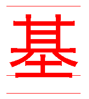
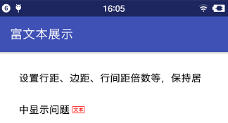

##  1、需求  
标题+标签组合显示。标签字体放在标题后面，标签四周加框并呈1dp圆角。  
  

<br />
##  2、方案  
使用TextView承载，结合SpannableString实现图文并排，具体选取ImageSpan实现标签样式。
###  绘制文字 
在西文中，有基线（baseline）、升部（ascent）、降部（descent）的概念。  
  
```  
/**
 * Class that describes the various metrics for a font at a given text size.
 * Remember, Y values increase going down, so those values will be positive,
 * and values that measure distances going up will be negative. This class
 * is returned by getFontMetrics().
 */
public static class FontMetrics {
    /**
     * The maximum distance above the baseline for the tallest glyph in
     * the font at a given text size.
     */
    public float   top;
    /**
     * The recommended distance above the baseline for singled spaced text.
     */
    public float   ascent;
    /**
     * The recommended distance below the baseline for singled spaced text.
     */
    public float   descent;
    /**
     * The maximum distance below the baseline for the lowest glyph in
     * the font at a given text size.
     */
    public float   bottom;
    /**
     * The recommended additional space to add between lines of text.
     */
    public float   leading;
}
```
通常来说中文就没有这样的概念，不过在绘制的时候，和英文字符的绘制并无两样，也是有类似基线、升部、降部的区分。  


```
canvas.drawText("基", x, y, mPaint);
float size = mPaint.measureText("基");
canvas.drawLine(x, y + mPaint.ascent(), x + size, y + mPaint.ascent(), mPaint);
canvas.drawLine(x, y, x + size, y, mPaint);
canvas.drawLine(x, y + mPaint.descent(), x + size, y + mPaint.descent(), mPaint);
```

绘制文字有两个关键点
>*  文字的宽高由字号大小决定:   
height = paint.descent() - paint.ascent()  
width = paint. measureText(String)  
*  文字绘制的起点由x和y决定:  
y 就是基线（baseline）的坐标  
y + paint.ascent() 就是问题的降部坐标  
y + paint.descent() 就是问题的降部坐标

###  绘制背景图 
ImageSpan extends DynamicDrawableSpan  
源码中，ImageSpan并没有重写draw方法，而是使用父类DynamicDrawableSpan的绘制。  
```
public void draw(Canvas canvas, CharSequence text,
                 int start, int end, float x, 
                 int top, int y, int bottom, Paint paint) {
    Drawable b = getCachedDrawable();
    canvas.save();
    
    int transY = bottom - b.getBounds().bottom;
    if (mVerticalAlignment == ALIGN_BASELINE) {
        transY -= paint.getFontMetricsInt().descent;
    }

    canvas.translate(x, transY);
    b.draw(canvas);
    canvas.restore();
}

public DynamicDrawableSpan() {
    mVerticalAlignment = ALIGN_BOTTOM;
}
```  
绘制背景图，有个关键点是画布会作偏移处理：  
canvas.translate(x, transY)  
注意到：  
transY = bottom - b.getBounds().bottom  
这代表什么意思呢？背景图距离view底部多少就整体往下偏移多少，也就是说背景图默认是从view底部开始的，与背景图设置的Rect（left, top, right, bottom）中Y轴上的坐标系没有绝对关系，反正都是会偏移到view底部中来。  
一句话就是，自动与view的bottom值对齐。  
修改x和bottom数据，就可以随意把背景图绘制到那个位置

<br />
##  3、实现

###  思路 
绘制文字，基准线y。要居中，也就是中心点保持一致，计算字号修改后基准线的值。  
y + paint.ascent() + y + paint.descent() = y + paint.ascent() + y + paint.descent()  
绘制背景，背景图下边沿与bottom值对齐。  
y + paint.decent() + 背景图宽度 + 其他的设置效果 = bottom  
  
###  代码 
ImageSpan extends DynamicDrawableSpan  
源码中，ImageSpan并没有重写draw方法，而是使用父类DynamicDrawableSpan的绘制。  
```
SpannableString msp = new SpannableString(title + mark);
msp.setSpan(new ImageSpan(mDescriBg) {
    @Override
    public int getSize(Paint paint, CharSequence text, int start, int end, Paint.FontMetricsInt fm) {
        paint.setTextSize(fontSize);
        width.add(0, Math.round(paint.measureText(text, start, end)));
        //整体左边加2个，加上文字内部左右各一个4个
        return width.get(0) + 4 * fontPadding;
    }
    @Override
    public void draw(Canvas canvas, CharSequence text, int start, int end, float x, int top, int y, int bottom,
                     Paint paint) {
        float oldad = paint.descent() + paint.ascent();
        paint.setTextSize(fontSize);
        float newad = paint.descent() + paint.ascent();
        //以改变前的字体为中间基准
        int baseY = (int)(y * 2 + oldad - newad ) / 2;
        int textHeight = (int)(paint.descent() - paint.ascent());
        //字体净高度 + 背景边界宽度=总高度
        int height = textHeight + cornerSize * 2;
        //背景图的要显示实际下边沿，作为bottom
        int bgBottom = (int)(baseY + paint.descent() + cornerSize);
        getDrawable().setBounds(
                0,
                0,
                width.get(0) + 2 * fontPadding,
                height);
        super.draw(canvas, text, start, end, x + 2 * fontPadding, top, y, bgBottom, paint);
        paint.setColor(Color.RED);
        //paint.setTypeface(Typeface.create("normal", Typeface.BOLD));
        canvas.drawText(text.subSequence(start, end).toString(),
                x + fontPadding * 3,
                baseY, paint);
    }
}, title.length(), title.length() + mark.length(), Spanned.SPAN_EXCLUSIVE_EXCLUSIVE);
```  