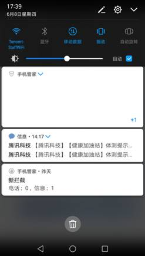

#### 1 通知栏“Couldn't expand RemoteViews”异常解析

##### 1.1 源码分析，跨进程传递UI，升级后id变动，版本升级的时候crash

App向系统发起通知栏请求时，向系统传递了一个RemoteViews对象，里面包括了包名，布局id，图片资源id，wording字符串等，全部是基础类型，Action封装View操作和设置等。每当调用一次set方法，就会将该View操作封装成一个Action。当调用Manager提交更新的操作时，就会将这些Action传输到SystemServer进程中。到达后，在SystemServer中调用RemoteViews的apply()，apply()会遍历所有的Action并依次其执行apply()，通过布局id找到layout文件并展开成界面，填充图片，文字等资源。

当RemoteViews的布局资源文件传输到另外一个进程时，布局文件的id可能是无效。所以需要使用布局资源文件名来加载。修改如下，先确定id，加载布局，调用reapply()更新RemoteViews，最后add。但对于通知栏这种系统处理的，就无可奈何了。

```Java
int layoutId = getResources().getIdentifier("widget", "layout", getPackageName());
View view = getLayoutInflater().inflate(layoutId, mContent, false);
remoteViews.reapply(context, view);
mContent.addView(view);
```

Android的编译安装包的时候，按字母排序遍历layout布局并按这个顺序转换成布局id（至少目前是这么做的），而控件id是在遍历布局过程中，按遍历到的先后顺序生成及排序。那么，修改通知栏布局的命名，让它的布局id发生变化。

##### 1.2 解决方案

**版本升级，注意layout的资源id，不要变动，保证空布局的生成id能对应旧版本**

应用升级的时候，旧进程没被系统杀死，或者已经被系统杀死，但是有一些外部原因又把应用拉活，导致升级过程中应用进程仍在运行。**在新版本放一个空的布局，也就是null，并精确选择好布局的名称，使得新版本生成这个空布局的布局id和旧版本的通知栏布局id一致**。


#### 2 华为8.0系统RemoteServiceException分析与解决办法

应用在灰度时发现华为8.0手机系统会高频出现一个覆盖安装的crash：**\*RemoteServiceException：Bad notification posted from package com.tencent.xx***，这个crash排除notification使用不当的原因的话，出现的频率应该是很低才对，如果高频出现一定是出了什么我们不知道的问题，所以拿到一个华为的8.0手机，大胆尝试。既然是高频出现，那么我们只要模拟覆盖安装，发出notification就可以复现此crash，所以我们写一个demo，用来复现crash。

##### 2.1 华为8.0手机的智能通知管理有[bug](https://www.aboutuoba.com/2018/06/22/RemoteServiceException-Bad-notification.html)

##### 2.2 不要使用RemoteViews.addView(int viewId, RemoteViews nestedView)函数

# [Android RemoteViews addView only first view showing](https://stackoverflow.com/questions/9484029/android-remoteviews-addview-only-first-view-showing)

A child of the view being added had the attribute layout_alignParentBottom="true", which caused it to fill the whole parent, blocking any additional children.

部分旧机型会crash

华为手机可能出现大块空白



厂商的本意是读出content，并在空白处显示最近的4条通知栏content。如果是自定义界面的通知栏，会读不到content，那一行空白。如果4条通知栏都是自定义，就会出现一大块空白。解决办法是尽量减少多条通知栏同时存在的情况


#### 3 通知栏适配那些事

##### 3.1 通知栏背景适配

##### 3.1.1 问题描述 通知栏背景适配

安卓手机的通知栏，可以设置背景颜色，也可以不设置；如果不设置，通知栏将使用系统默认的背景色。目前，大多数手机的背景色是黑色，但也存在少数背景为白色的手机。通知栏背景想做成自适应系统颜色，最自然想到的方法，当然就是不设置通知栏背景，直接使用系统背景。但是实验发现，如果不设置背景色，在部分手机上，如索尼、联想等，管家的通知栏背景会呈现出灰白色，与正常的通知栏不协调。

##### 3.1.2 解决方案

1） 在AndroidMenifest.xml文件中，有一个uses-sdk标签，该标签有三个属性，分别是android:minSdkVersion，android:targetSdkVersion和android:maxSdkVersion。

uses-sdk用来声明一个应用所兼容的API区间，即所兼容的系统版本。android:targerSdkVerison属性，声明一个应用已经兼容的API，如果没有设置，默认值等于android:minSdkVersion。这个属性告诉系统，你已经对该API级别的系统进行过测试，系统不需要进行兼容性检查，而且该应用可以运行在API处于android:minSdkVersion到android:targerSdkVersion之间的其它系统。如果系统的API比android:targerSdkVersion还高，系统可能开启兼容性检查。通过提高targetSdkVersion的值，可以关闭系统的兼容性检查；同时，当应用运行在大屏机上的时候，可以关闭屏幕兼容性模式。基于你设置的值，系统会开启很多兼容性检查。部分兼容性检查会在对应版本的Build.VERSION_CODES文档中提到。随着android新版本的发布，你需要提高这个值来适配最新的API，并在相应系统上进行严格的测试。uses-sdk这个标签，是从API等于4的系统开始引入。

手机管家的uses-sdk标签如下：<uses-sdk android:minSdkVersion="7" />，意味着android:targerSdkVerison的值也是7。 手Q，搜狗输入法的targetSdkVersion等于7，故两者在上述手机上的通知栏背景呈灰白色；其它软件的值高于8，故其它软件在上述手机的通知栏背景与系统通知栏背景一致。

**从系统源可以查到原因，6.0.1版本有BaseStatusBar.applyColorsAndBackgrounds会针对应用的target设置不同的背景颜色。**

2）解决办法很简单，不要设置背景图片，也不要指定背景颜色，连android:background=‘#00000000’也不要设置

##### 3.2  通知栏字体颜色适配

通知栏字体的颜色，需要根据系统通知栏的背景颜色进行调整。由于无法获知系统通知栏的颜色，我们无法彻底地一劳永逸地解决这个问题；但是，我们可以靠经验找到一些适配性较好的方案，**尽量减少出错的概率**。

如果target没有升到23以上的方法，暂时未遇到不适配的机型。

如果target升到23以上就有点麻烦了，大量机型的背景发生变化，部分机型的style需要从TextAppearance.StatusBar.EventContent.Title变更为TextAppearance.Material.Notification.Title，更麻烦的是，你无法知道哪些机型需要变更，需要不停地消耗人力来应对新机型！

为此在target升到23之后，分两种情况处理，2.3-4.4系统仍然沿用上述方法，5.0及以上机型，采用新方法：构造一个空的通知栏，遍历通知栏控件上的所有组件，获取里面TextView的字体颜色。

经优测验证，在target升到23之后，新方法可以适配大部分固件为5.0以上的机型。当然，仍有一些恶心的改得很不像话的系统无法适配，需要hardcord颜色值，比如vivo。

##### 3.3 通知栏边距适配

同一个包，安装在两台手机上，在华为P8手机上图标偏右，而在魅蓝手机上，图标偏左。所以，**你无法用某个固定的边距，去适配海量的无规律的手机系统**！

通知栏界面必须对应某个layout文件，且layout文件有诸多限制，只能使用限定的几个控件，且只有控件中的个别属性可以动态修改，通知栏控件的宽度不能动态修改。

解决方案是，在layout文件两侧增加若干个长方形控件linearlayout，虽然控件的无法改变控件宽度，但是可以**设置控件不可见**。四个长方形的宽度分别是1dip，2dip，4dip，8dip，如果某种机型的最佳左边距是6dip，那么把1dip和8dip控件设为不可见，把2dip，4dip控件设不可见。


