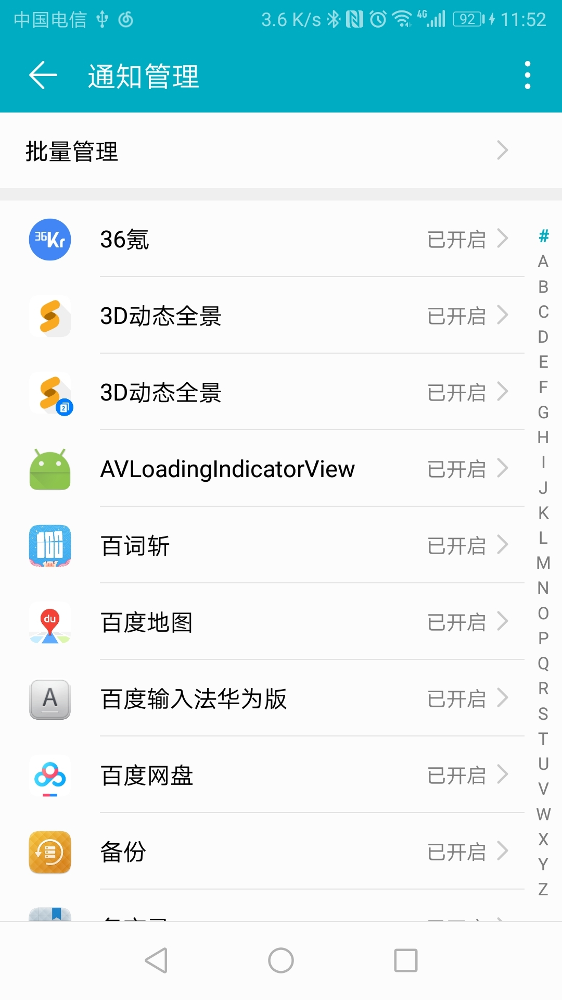
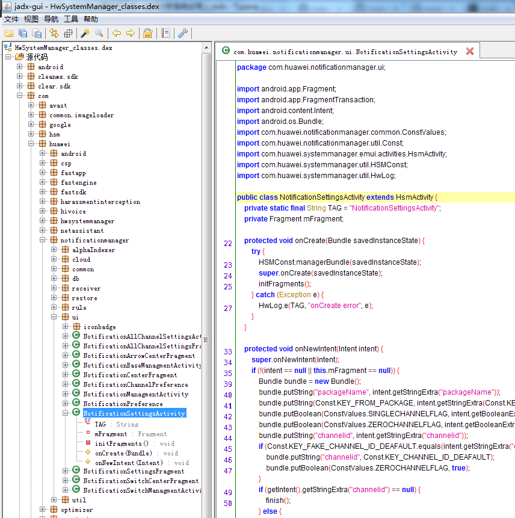

主要是接手通知栏，便搜索了介绍关于通知栏的文章，以此做了整理。

##### 1、寻找apk包

打开手机设置中的#通知管理#，通过adb shell dumpsys activity top获取当前Activity信息，可以知道app包名为:com.huawei.systemmanager。也可以在界面中随意点击，过滤tag为ActivityManager，看系统调用的log，找到调用关系和包名。



如通过adb，得到相关信息，可以看到通知栏管理的apk包名为：com.huawei.systemmanager

```
TASK com.android.settings id=2051 userId=0
  ACTIVITY com.huawei.systemmanager/com.huawei.notificationmanager.ui.NotificationManagmentActivity ee93320 pid=27279
    Local Activity 3bd5749 State:
      mResumed=true mStopped=false mFinished=false
      mChangingConfigurations=false
      mCurrentConfig={1.0 460mcc3mnc [zh_CN_#Hans] ldltr sw360dp w360dp h565dp 480dpi nrml port finger -keyb/v/h -nav/h appBounds=Rect(0, 0 - 1080, 1768) nonFul
lScreen=0 suim:1 s.85}
      mLoadersStarted=true
```

通过pm list package -f | grep com.huawei.systemmanager 可以知道该包名对应的apk文件路径。

```
C:\Users\Administrator\Desktop\notification>adb shell
HWDUK:/ $ pm list package -f | grep com.huawei.systemmanager
package:/system/priv-app/HwSystemManager/HwSystemManager.apk=com.huawei.systemmanager
HWDUK:/ $
```

可以看到，包名存储的路径为/system/priv-app/HwSystemManager/，存储的名称为HwSystemManager.apk。

也可以通过adb shell dumpsys activity activities直接找出。

```
C:\Users\Administrator\Desktop\notification>adb shell dumpsys activity activities | grep baseDir
          baseDir=/system/priv-app/Settings/Settings.apk
          baseDir=/data/app/com.tencent.mobileqq-D_6UCcKaUU9giuyNU8pagA==/base.apk
          baseDir=/system/priv-app/Settings/Settings.apk
          baseDir=/data/app/com.tencent.mm-MJfgclVsQtIBO-8-cclN_w==/base.apk
          baseDir=/data/app/com.tencent.mm-MJfgclVsQtIBO-8-cclN_w==/base.apk
          baseDir=/data/app/com.huawei.hidisk-RgwufWqMfqR_c7oSGKOaFQ==/base.apk
          baseDir=/system/priv-app/HwSystemManager/HwSystemManager.apk
          baseDir=/system/priv-app/InCallUI/InCallUI.apk
          baseDir=/system/app/HwLauncher6/HwLauncher6.apk
          baseDir=/system/priv-app/SystemUI/SystemUI.apk
```

拉取/system/priv-app/HwSystemManager/HwSystemManager.apk，进行反编译。将其拉取到当前目录，出现一直都拉取不成功，拉到一大半就停止不动了。则不折腾，直接将文件夹复制到sd卡中，手动copy出来。

```
C:\Users\Administrator\Desktop\notification>adb pull /system/priv-app/HwSystemManager/ .
^C62%] /system/priv-app/HwSystemManager/HwSystemManager.apk: 96%
C:\Users\Administrator\Desktop\notification>adb shell
HWDUK:/ $ cp -R /system/priv-app/HwSystemManager/ /sdcard
```

##### 2、反编译

打开文件夹可以看到一个apk、一个lib文件和一个oat文件，把apk解压缩却发现这里没有classes.dex文件，这明显是一个经过odex的apk。系统的Rom会把系统apk的dex提取出来优化成odex，这里需要apk和odex和并才能反编译，而oat文件正是放着odex文件（lib放的是.so）。所以我们想要从apk中得到class文件从而得到源码的话，我们必须进行 odex——>dex——>jar——>class 的一系列转换。

使用[baksmali/smali](https://bitbucket.org/JesusFreke/smali/downloads/)将vdex/odex——>dex，使用dex2jar将dex——>jar，使用Java Decompiler将jar——>class，也可以使用jadx-gui将dex转换为java代码。

目前不同的android版本，提取dex未必适用，需要另寻其他方法。

android 8.x以后使用[vdexExtractor](https://github.com/anestisb/vdexExtractor)，将vdex-->dex，**vdexExtractor**只是提供了源码，需要自己编译为可执行的文件，可以直接找一个可执行的就可以了。

```
C:\Users\Administrator\Desktop\notification>vdexExtractor.exe -i HwSystemManager.vdex
[INFO] Processing 1 file(s) from HwSystemManager.vdex
[ERROR] vdex_backend_006_process method called
[ERROR] vdex 006 write dex file
[ERROR] outWriter_DexFile
[INFO] 1 out of 1 Vdex files have been processed
[INFO] 1 Dex files have been extracted in total
[INFO] Extracted Dex files are available in '.'
```




##### 3、分析

 一般log会给出一些可用的信息，这里可以通过操作对应的开关按钮，查看logcat输出，从中分析切入点。

uid:  android中uid用于标识一个应用程序，uid在应用安装时被分配，并且在应用存在于手机上期间，都不会改变。一个应用程序只能有一个uid，多个用户可以使用sharedUserId 方式共享同一个uid，前提是这些应用的签名要相同。
 pid :  进程ID，可变的
 gid:  对应于linux中用户组的概念，android 中 gid 等于uid